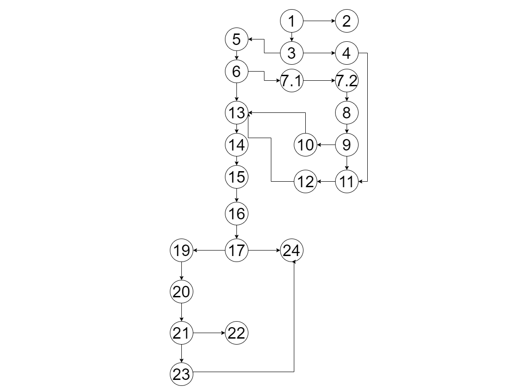

Андреј Новковиќ 203136

#Control Flow Graph

#Цикломатска комплексност

Цикломатската комплексност на овој код е 5,
истата ја добив преку формулата V(G) = E – N + 2,
 каде што E означува број на работи , а N означува број на јазли.
Во случајoв Е=27,N=24, па цикломатската комплексност изнесува 5.
